<h1>Hi, I'm Nikhil Kumar 👋</h1>

 

---

### 🧑‍💻 About Me

I'm a passionate developer who loves building products that blend clean design with powerful functionality. From e-commerce platforms to smart agricultural tools — I turn ideas into full-stack experiences.

- 🔭 &nbsp;Currently building **full-stack web applications**
- 🌱 &nbsp;Exploring **Node.js**, **REST APIs**, and **system design**
- ⚡ &nbsp;Fun fact: I once built a delivery management system entirely in C++

---

### 🛠 Tech Stack

**Languages**

**Tools & Platforms**

---

### 🚀 Featured Projects

| Project | Description | Tech |
|--------|-------------|------|
| [🏨 LUXESTAY](https://github.com/nikhilkumar905/LUXESTAY) | A full-featured luxury room booking platform with real-time listings, booking management, and user authentication | `Node.js` `JavaScript` `JSON` |
| [🌾 AgriLink Innovators](https://github.com/nikhilkumar905/Project_AgriLink_Innovators) | Smart agricultural platform connecting farmers with resources, market data, and modern farming tools | `HTML` `CSS` `JavaScript` |
| [🛍️ E-Commerce for Men's Wear](https://github.com/nikhilkumar905/E-commerce_for_men-s_wear) | A complete men's fashion e-commerce store with product pages, cart, and user authentication | `HTML` `CSS` `JS` `PHP` `SQLite` |
| [📚 Friends Pathshala](https://github.com/nikhilkumar905/Peer-to-peer-learning-platform) | Peer-to-peer learning platform where students and teachers connect, form groups, and share knowledge | `HTML` `CSS` `JavaScript` |
| [🚚 Delivery Management System](https://github.com/nikhilkumar905/Delivery-Management-system) | Console-based system for managing deliveries, drivers, and order tracking using OOP in C++ | `C++` |
| [📖 Dictionary via API](https://github.com/nikhilkumar905/Dictionary-using-API-) | Elegant dictionary app fetching live word definitions, phonetics, and examples through a REST API | `Python` |

---

### 📊 GitHub Stats

---

### 📬 Connect with Me

  ⭐ If you like what I build, feel free to star a repo or say hello!

